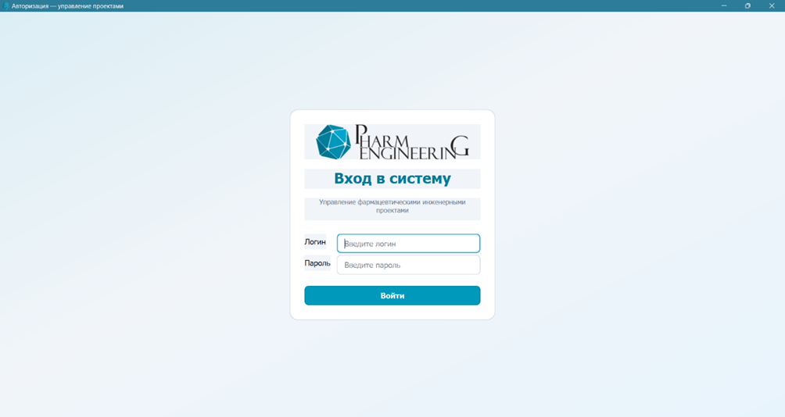
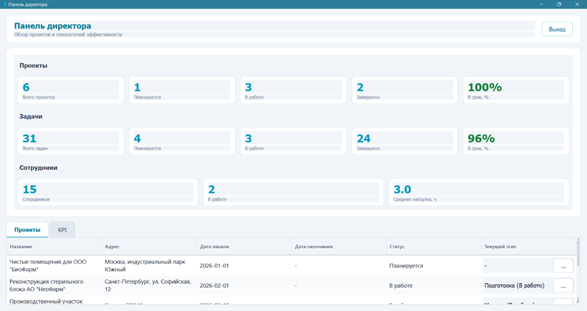
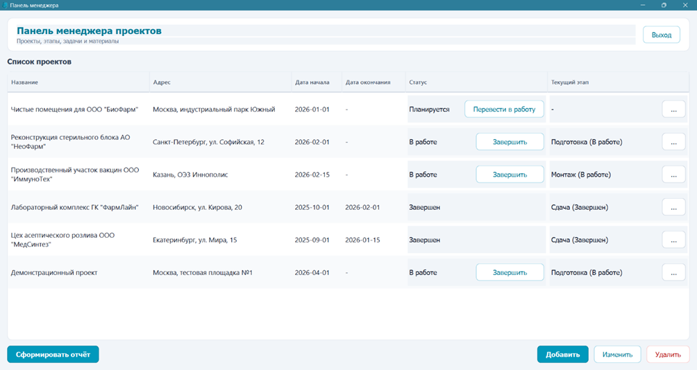
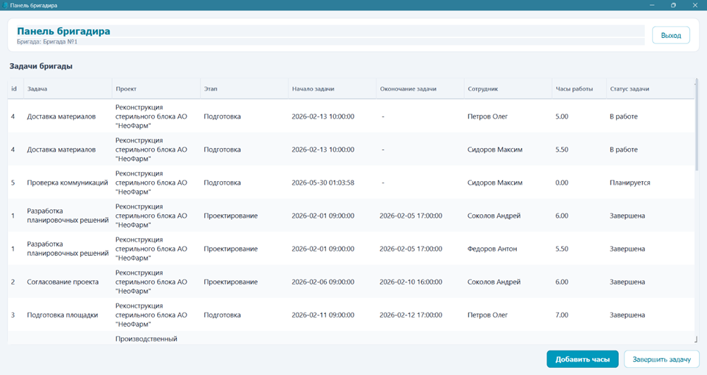
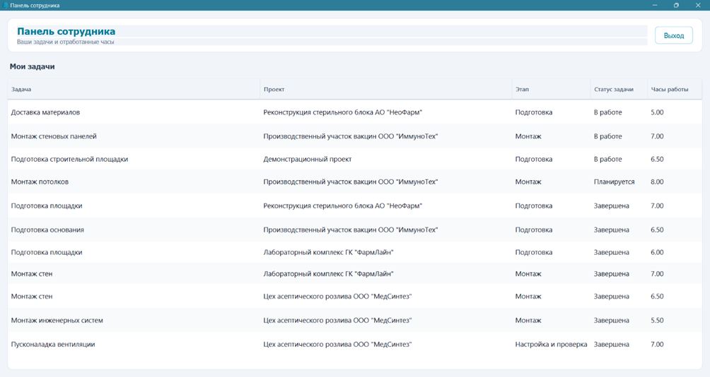
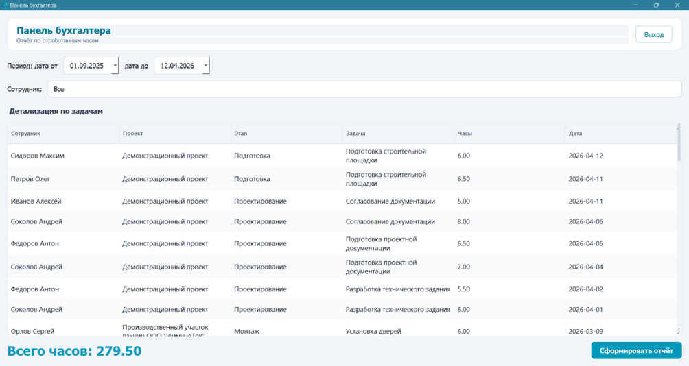
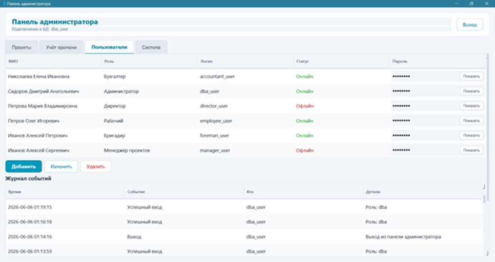
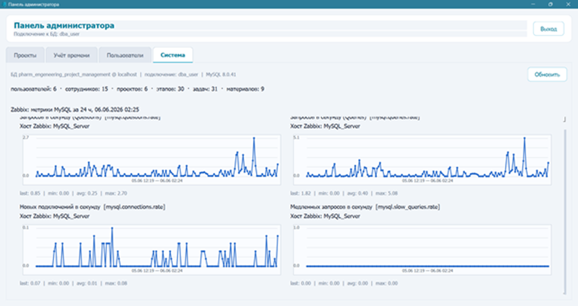
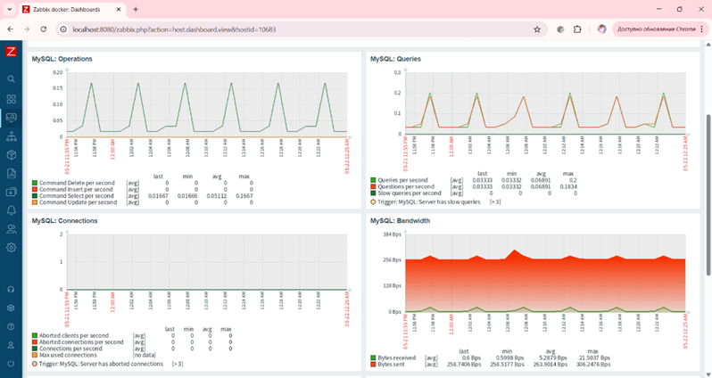

#  Project Management System 


Информационная система управления проектами и сотрудниками с системой мониторинга производительности.

Проект разработан в рамках выпускной квалификационной работы по теме:

**«Разработка и администрирование базы данных модуля управления проектами с внедрением системы мониторинга производительности».**

Система предназначена для автоматизации процессов управления проектной деятельностью предприятия, учета сотрудников, контроля выполнения задач, анализа эффективности работы и мониторинга состояния базы данных.

---

# ✨ Ключевые особенности

⭐ Управление проектами и сотрудниками.

⭐ Ролевая модель пользователей.

⭐ Автоматический расчет KPI сотрудников.

⭐ Автоматическое обновление статусов проектов.

⭐ Контроль корректности данных с помощью триггеров.

⭐ Аудит изменений и журналирование действий пользователей.

⭐ Мониторинг производительности системы с использованием Zabbix.

⭐ Формирование отчетов в формате Microsoft Word.

---

# 🚀 Основные возможности

## 👥 Управление сотрудниками

* хранение информации о сотрудниках;
* учет специализаций;
* управление составом бригад;
* разграничение доступа пользователей.

## 📁 Управление проектами

* создание проектов;
* контроль этапов выполнения;
* изменение статусов проектов;
* контроль сроков реализации.

## ✅ Управление задачами

* создание и распределение задач;
* назначение исполнителей;
* учет времени выполнения;
* контроль выполнения работ.

## ⏱ Учет трудозатрат

* регистрация рабочего времени;
* анализ загрузки сотрудников;
* накопление статистики выполнения задач.

## 📦 Управление материалами

* учет используемых материалов;
* контроль расхода ресурсов;
* привязка материалов к проектам и этапам.

## 📈 Анализ эффективности

* автоматический расчет KPI сотрудников;
* анализ производительности;
* хранение показателей эффективности;
* получение агрегированной статистики.

---

# 🏗 Архитектура системы

Система состоит из трех основных компонентов.

## 🖥 Клиентское приложение

Предоставляет графический интерфейс для работы пользователей с системой.

Основные функции:

* авторизация;
* управление сотрудниками;
* управление проектами;
* управление задачами;
* учет трудозатрат;
* управление материалами;
* просмотр показателей эффективности;
* администрирование системы.

## 🗄 База данных

Централизованно хранит информацию о:

* сотрудниках;
* пользователях;
* проектах;
* этапах;
* задачах;
* материалах;
* трудозатратах;
* показателях производительности;
* событиях аудита.

Для обеспечения надежности используются:

* ограничения целостности;
* триггеры;
* хранимые процедуры;
* журналирование изменений;
* аудит действий пользователей.

## 📡 Система мониторинга

Для контроля состояния системы используется Zabbix.

Мониторинг позволяет:

* отслеживать производительность базы данных;
* контролировать состояние системы;
* анализировать нагрузку;
* получать информацию о работе сервисов;
* отображать основные показатели производительности.

---

# 👥 Пользовательские роли

Система предусматривает несколько уровней доступа.

| Роль                 | Основные возможности                     |
| -------------------- | ---------------------------------------- |
| 👔 Директор          | Контроль проектов и анализ деятельности  |
| 📋 Менеджер проектов | Управление проектами, этапами и задачами |
| 👷 Бригадир          | Учет трудозатрат сотрудников             |
| 👨‍💼 Сотрудник         | Просмотр назначенных задач               |
| 💰 Бухгалтер         | Работа с трудозатратами и отчетностью    |
| ⚙ Администратор      | Управление системой и мониторинг         |

---

# 🔒 Безопасность

В проекте реализованы механизмы защиты данных:

* авторизация пользователей;
* хранение паролей с использованием bcrypt;
* разграничение прав доступа;
* защита от SQL-инъекций;
* аудит изменений;
* журналирование действий пользователей.

---

# 📈 Мониторинг и администрирование

Система включает средства мониторинга и администрирования:

* интеграция с Zabbix;
* получение данных через API;
* отображение показателей производительности;
* просмотр состояния системы;
* анализ нагрузки.

---

# 🔍 Аудит системы

Реализован механизм аудита, позволяющий:

* фиксировать вход и выход пользователей;
* отслеживать действия пользователей;
* хранить историю изменений;
* регистрировать успешные и неуспешные операции;
* анализировать события безопасности.

---

# 📄 Формирование отчетов

Система поддерживает автоматическое формирование отчетов в формате Microsoft Word.

В зависимости от роли пользователя могут быть сформированы документы с актуальной информацией о проектах, сотрудниках и производственных показателях.

---

# 🗄 Особенности базы данных

При разработке базы данных реализованы:

* инфологическая модель;
* даталогическая модель;
* физическая модель;
* ограничения целостности;
* триггеры;
* хранимые процедуры;
* аудит изменений;
* логирование;
* механизмы автоматизации бизнес-процессов.

---

# 🛠 Используемые технологии

* Python
* PyQt6
* MySQL
* SQL
* bcrypt
* python-docx
* Zabbix
* Docker
* PyMySQL
---

# 📸 Интерфейс системы

## 🔐 Авторизация

Авторизация пользователей осуществляется с учетом ролевой модели доступа.



---

## 👔 Панель директора

Рабочее окно директора предназначено для контроля проектов и анализа деятельности организации.



---

## 📋 Панель менеджера проектов

Менеджер проектов управляет проектами, задачами и распределением ресурсов.



---

## 👷 Панель бригадира

Бригадир контролирует выполнение работ и учет трудозатрат сотрудников.



---

## 👨‍💼 Панель сотрудника

Сотрудник получает доступ к назначенным задачам и рабочей информации.



---

## 💰 Панель бухгалтера

Бухгалтер работает с трудозатратами сотрудников и формированием отчетности.



---

## ⚙️ Панель администратора

Администратор может выполянть функции менеджера проектов или бригадира, а также управляет учетными записями пользователей и их правами доступа.



и контролирует работу системы и основные параметры приложения.



---

## 📈 Мониторинг производительности

Система интегрирована с Zabbix для контроля состояния базы данных и анализа производительности.



---

# 🚀 Запуск проекта

```bash
git clone https://github.com/your_username/project-management-system.git
cd project-management-system
pip install -r requirements.txt
python main.py
```

Перед запуском необходимо:
- импортировать SQL-скрипты из папки `sql`;
- настроить подключение к MySQL и Zabbix в `config.py`.

---

# 📂 Структура проекта

```text
project-management-system/

│
├── data/
│   ├── icon.png
│   └── logo.png
│
├── diagrams/
│   ├── database_schema.png
│   ├── architecture_of_the_client_application.png
│   └── architecture_of_the_monitoring_system.png
│
├── result_screenshots/
│   ├── auth.png
│   ├── director_window.png
│   ├── manager_window.png
│   ├── foreman_window.png
│   ├── employee_window.png
│   ├── accountant_window.png
│   ├── admin_window_system.png
│   ├── admin_window_users.png
│   └── zabbix.png
│
├── sql/
│   ├── database.sql
│   └── audit_logging.sql
│
├── windows/
│   ├── auth_window.py
│   ├── director_panel_window.py
│   ├── manager_panel_window.py
│   ├── foreman_panel_window.py
│   ├── employee_panel_window.py
│   ├── accountant_panel_window.py
│   ├── admin_panel_window.py
│   └── report_dialogs.py
│
├── main.py
├── db.py
├── config.py
├── audit_service.py
├── password_hash.py
├── word_report.py
├── zabbix_client.py
├── ui_assets.py
├── ui_tables.py
├── ui_theme.py
├── requirements.txt
├── .gitignore
└── README.md
```

---

# 🎓 О проекте

Проект разработан в рамках выпускной квалификационной работы и представляет собой информационную систему управления проектной деятельностью предприятия.

В ходе разработки были реализованы механизмы проектирования и администрирования базы данных, автоматизации бизнес-процессов, обеспечения безопасности данных, мониторинга производительности и контроля состояния информационной системы.

Проект объединяет технологии разработки десктопных приложений, проектирования баз данных и системного администрирования в единую программную систему.
